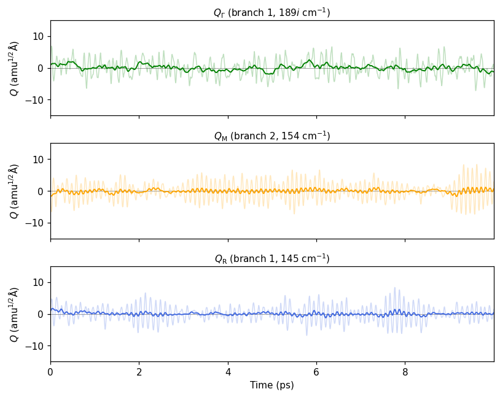

# Phonon mode projection

Project an *ab initio* molecular dynamics trajectory onto phonon normal modes, and watch how much
of each mode is present as a function of time.

The example in this repository reproduces **Figure 3** of

> *Exploring anharmonic lattice dynamics and dielectric relations in niobate perovskites from
> first-principles self-consistent phonon calculations*,
> npj Computational Materials **9**, 154 (2023) — <https://doi.org/10.1038/s41524-023-01110-8>

for cubic KNbO<sub>3</sub>: 10 ps of AIMD on a 2×2×2 supercell, projected onto the soft polar
(Γ), and antiferrodistortive (M and R) phonon modes.



## What is computed

Each MD snapshot is a set of displacements **u**<sub>a</sub> from the ideal structure. Rather than
40 atoms × 3 directions, the mode amplitude asks *how much of one phonon mode* a snapshot contains:

```
Q_qν(t) = Σ_a √m_a · u_a(t) · Re[ e_qν^p(a) · exp(2πi q·R_a) ]
```

with `m_a` the mass in amu, `e_qν` the phonon eigenvector from ALAMODE, `p(a)` the equivalent atom
in the primitive cell and `R_a` the lattice point of atom `a`. `Q` is in amu<sup>1/2</sup> Å. This
is the same convention as ALAMODE's `displace.py --pes`.

Phonons may come from **ALAMODE** or **phonopy** — the two codes use different phase
conventions for their eigenvectors, and `modeproj` converts them onto the same footing (see
[Phonons from phonopy](#phonons-from-phonopy) and [Conventions](#conventions-and-limitations)).

## Requirements

Python ≥ 3.8 with `numpy`, `ase` and `matplotlib`:

```bash
pip install -r requirements.txt        # or: pip install -e .
```

Optional, depending on where your phonons come from: `PyYAML` (phonopy `*.yaml`), `h5py`
(phonopy `*.hdf5`), `phonopy` itself (to compute eigenvectors from force constants):

```bash
pip install -e ".[phonopy]"            # PyYAML + h5py + phonopy
```

## The example data

| file | what it is |
|---|---|
| `XDATCAR` | AIMD trajectory: 10000 frames × 40 atoms, 1 fs steps |
| `PPOSCAR` | primitive cell, 5 atoms |
| `SPOSCAR` | MD supercell, 40 atoms (2×2×2) |
| `kno_221.mesh.evec.tar.gz` | phonon eigenvectors from ALAMODE `anphon` |

Unpack the eigenvectors once (60 MB unpacked, not tracked by git):

```bash
tar xzf kno_221.mesh.evec.tar.gz
```

## Quickstart

```bash
# 1. which q points does the supercell support, and what are their frequencies?
python -m modeproj modes

# 2. project the trajectory onto three modes, write a table and the figure above
python -m modeproj project --mode G:1 --mode M:2 --mode R:1 \
    --timestep 1.0 --out amplitudes.csv --plot amplitudes.png --histogram histogram.png
```

`modes` prints

```
label  q (primitive recip.)     frequencies in cm^-1 (branch 1, 2, ...)
G       0.000  0.000  0.000      -188.66   -188.66   -188.66      0.00      0.00      0.00 ...
X      -0.500  0.000  0.000      -131.84   -131.84    144.76    144.76    161.11    161.11 ...
M      -0.500 -0.500  0.000       -93.83    153.69    156.29    156.29    161.31    260.22 ...
R      -0.500 -0.500 -0.500       144.98    144.98    144.98    175.86    175.86    175.86 ...
```

Negative values are imaginary (unstable) frequencies. Modes are selected as `LABEL:BRANCH`, where
branches are numbered from 1 by increasing frequency, exactly like the `### mode` entries of the
`.evec` file. Explicit coordinates work as well: `--mode 0.5,0.5,0.5:1` is the same as `--mode R:1`.
Members of the same star are symmetry equivalent and get numbered labels (`X`, `X2`, `X3`).

Useful options for `project`:

| option | meaning |
|---|---|
| `--timestep 2.0` | MD time step in fs, sets the time axis |
| `--stride 10`, `--start`, `--stop` | use a subset of frames for a quick look |
| `--reference first \| mean \| supercell` | reference structure for the displacements |
| `--all-modes` | write the amplitude of every q point and branch |
| `--normalize` | divide by √N<sub>cell</sub> so amplitudes do not scale with the supercell |
| `--window 250` | running-average window (in frames) drawn on top of the raw signal |
| `--out amplitudes.csv \| .npz` | save the amplitudes |

`python -m modeproj <command> --help` lists everything.

## Phonons from phonopy

Point `--evec` (alias `--phonons`) at any phonopy output; the format is guessed from the file
name, `--format` overrides it.

| what you have | how to use it |
|---|---|
| `phonopy.yaml` + force constants | `--evec phonopy.yaml --force-constants FORCE_CONSTANTS` (or `--force-sets FORCE_SETS`) — **recommended**: phonopy computes the eigenvectors exactly at the q points needed, nothing has to match |
| `qpoints.yaml` / `qpoints.hdf5` | `--evec qpoints.yaml` — from `phonopy --qpoints … --eigenvectors` |
| `mesh.yaml` / `mesh.hdf5` | `--evec mesh.hdf5` — the mesh must be **Γ-centred** (`--gc`) and contain the commensurate q points |
| `band.yaml` | `--evec band.yaml` — only if the band path passes through those q points |

```bash
# list the q points your supercell needs, and hand them to phonopy
python -m modeproj anphon-input --primitive PPOSCAR --supercell SPOSCAR   # &kpoint block
phonopy --qpoints "0 0 0  0.5 0.5 0  0.5 0.5 0.5" --eigenvectors -p

# project, using phonopy's force constants directly
python -m modeproj project --evec phonopy.yaml --force-constants FORCE_CONSTANTS \
    --primitive PPOSCAR --supercell SPOSCAR --xdatcar XDATCAR --mode R:1
```

or from Python:

```python
basis = ModeBasis.from_files("phonopy.yaml", "PPOSCAR", "SPOSCAR",
                             force_constants="FORCE_CONSTANTS")
```

Non-analytic term correction: `--nac` (with `--born BORN` if it is not next to the yaml file) and
`--nac-direction 1,0,0` for the direction along which q → 0 at Γ.

Two things are handled for you, and both are easy to get wrong by hand:

* **Phase convention.** phonopy puts the basis positions into the phase of its dynamical matrix,
  `exp(2πi q·(R + τ_b − τ_a))`, while ALAMODE uses `exp(2πi q·R)`. The eigenvectors differ by
  `exp(2πi q·τ_a)` per atom and are converted to the lattice convention on read.
* **Atom order and cell choice.** Your `PPOSCAR` defines the q-point basis and the atom order.
  If phonopy's primitive cell lists the same atoms in another order, the eigenvector components
  are permuted accordingly; if it is a different lattice altogether, you get an error instead of
  silently wrong amplitudes.

## Notebook

[`projection.ipynb`](projection.ipynb) walks through the same analysis step by step and adds
amplitude histograms (single-well vibration vs double-well hopping) and mode-resolved
⟨Q²⟩ values.

## Python API

```python
from modeproj import ModeBasis, read_xdatcar, plot_amplitudes

basis = ModeBasis.from_files("kno_221.mesh.evec", "PPOSCAR", "SPOSCAR")
print(basis.qpoint_table())

trajectory = read_xdatcar("XDATCAR", stride=1)
modes = [basis.select(spec) for spec in ("G:1", "M:2", "R:1")]

Q = basis.project_modes(trajectory.displacements(), modes)   # {"Q_G_1": array, ...}
Q_all = basis.project(trajectory.displacements())            # (nframes, nq, nbranch)
```

`ModeBasis.from_files` works out the supercell matrix, the commensurate q points and the
atom→(primitive atom, lattice point) mapping, then reads **only the required q points** from the
`.evec` file and caches the result in `<evec>.basis.npz`. A 60 MB mesh file is read in about a
second instead of a minute, and the whole trajectory is projected with a single `einsum`.

## Using your own data

1. Relax the primitive cell and build the MD supercell (`PPOSCAR`/`SPOSCAR` from phonopy work well).
2. Run an MD simulation in that supercell at fixed cell volume and shape, giving an `XDATCAR`.
3. Compute the phonons of that primitive cell and print the eigenvectors at the q points
   commensurate with the supercell — list them with

   ```bash
   python -m modeproj anphon-input --primitive PPOSCAR --supercell SPOSCAR
   ```

   With ALAMODE `anphon` those blocks go straight into the input file; with phonopy pass the same
   q points to `--qpoints … --eigenvectors`, or just keep `phonopy.yaml` and the force constants.
   Any denser mesh containing those q points works too — the example file is a 20×20×20 mesh.
4. Project:

   ```bash
   python -m modeproj project --evec PREFIX.evec --primitive PPOSCAR \
       --supercell SPOSCAR --xdatcar XDATCAR --mode R:1
   ```

## Conventions and limitations

* Amplitudes contain **no** 1/√N<sub>cell</sub> factor (ALAMODE convention), so they grow with the
  supercell size; `--normalize` / `project(..., normalize=True)` divides it out.
* Displacements use the minimum-image convention, so atoms that cross a periodic boundary do not
  produce spurious jumps.
* Only q points with **q** ≡ −**q** (components 0 or ±½) have a purely real normal coordinate. For
  other commensurate q points the real projection mixes +**q** and −**q**; a warning is issued.
* Within a degenerate set the individual eigenvectors are arbitrary up to a rotation, so a single
  `Q` is basis dependent. Use `basis.degenerate_branches(iq, imode)` and combine them as
  √(Σ Q²) when that matters.
* **Eigenvector phases are fixed before projecting.** A diagonaliser returns each eigenvector with
  an arbitrary global phase, and taking `Re[e·exp(2πi q·R)]` of a vector that happens to come back
  multiplied by *i* gives **zero amplitude** — several branches of the example `.evec` file are
  affected. `modeproj` removes that phase (and rotates genuinely complex degenerate groups to a
  real basis) first, which is why the projectors form a complete orthonormal set:
  Σ<sub>qν</sub> Q² = N<sub>cell</sub> Σ<sub>a</sub> m<sub>a</sub>|u<sub>a</sub>|² holds to machine
  precision. Doing it the naive way loses ~30 % of the norm for this example.
* A constant cell (NVE/NVT) is assumed. Frequencies come from ω² in Rydberg atomic units
  (ALAMODE) or from THz (phonopy), and are reported in cm<sup>-1</sup>.

## Repository layout

```
modeproj/            the package: readers, geometry, projection, plots, CLI
  evec.py            targeted reader for ALAMODE PREFIX.evec files
  phonopy_io.py      readers for phonopy yaml/hdf5 output and force constants
  sources.py         one entry point for every code, incl. format detection
  modedata.py        common container for frequencies and eigenvectors
  eigen.py           phase conventions, global-phase fixing, real eigenvector bases
  geometry.py        supercell matrix, commensurate q points, atom mapping, q labels
  basis.py           ModeBasis: eigenvectors + projection + mode selection
  trajectory.py      fast XDATCAR reader and displacements
  plot.py            amplitude-vs-time and histogram figures
  cli.py             python -m modeproj
tests/               unit tests, run with `python -m pytest`
  data/phonopy/      small phonopy fixtures + the script that generated them
projection.ipynb     annotated walk-through of the example
tools/               ALAMODE displace.py and its interfaces (MIT, T. Tadano), kept for
                     reference; the projection no longer imports them
```
